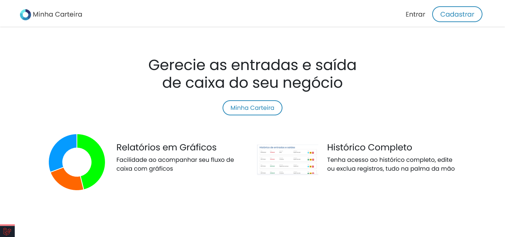
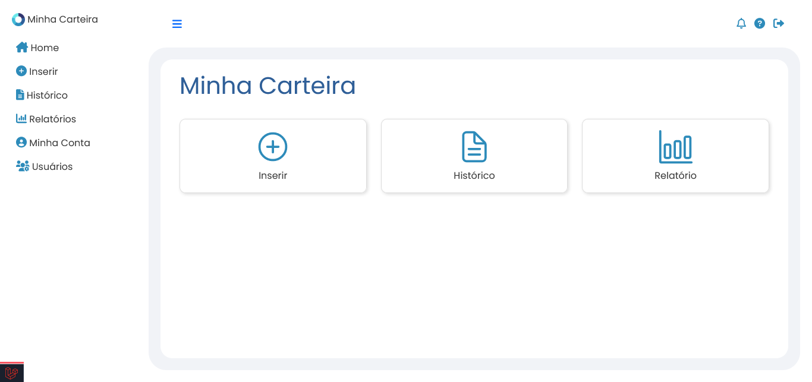
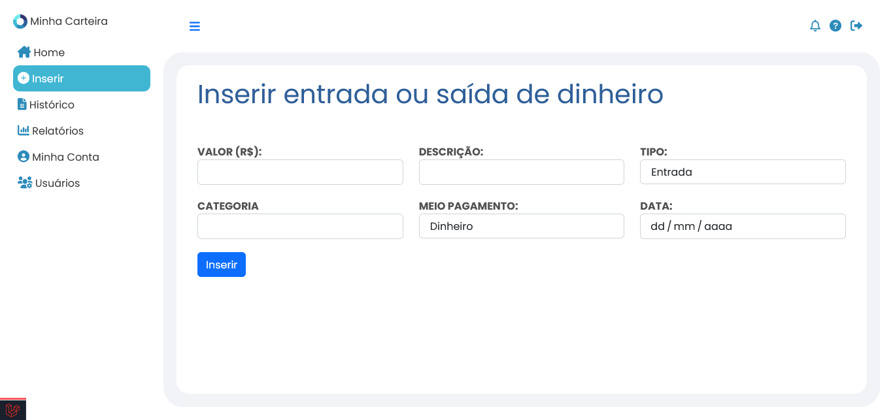
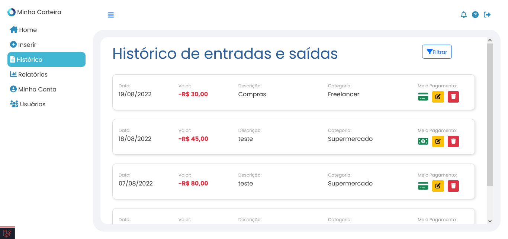
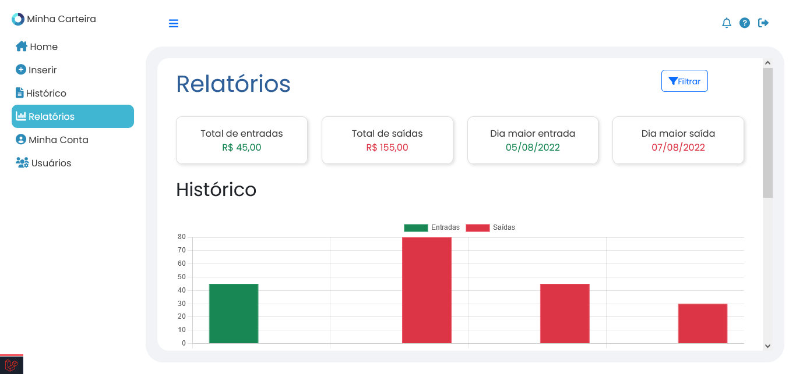
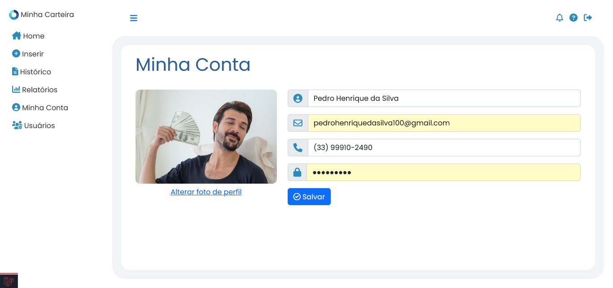
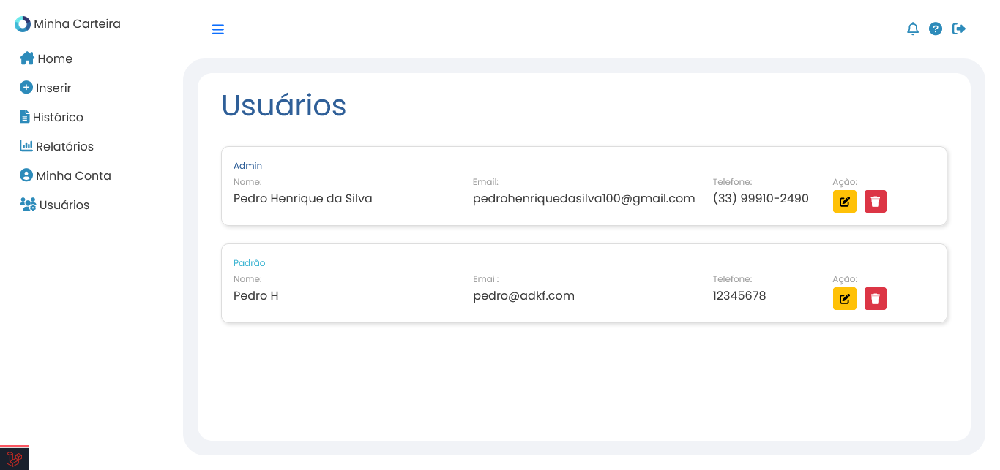

# Minha Carteira

##

Minha Carteira é um simples sistema para inserção e acompanhamento de entradas e saídas de dinheiro. Pode ser usado para controle de gastos pessoais ou comerciais.

      